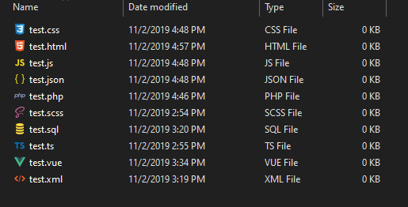

# Iconfile

Change default file icon on Windows.

## Screenshot

## Usage

Put svg in `/assets/svg/`.

Convert svg to ico.

`$ python -m converter`

Alter registry.

`$ python -m registry`

Restart system.

## About

[Detailed Introduction](https://akijoey.com/2019/11/02/%E4%BF%AE%E6%94%B9%20Windows%20%E6%96%87%E4%BB%B6%E9%BB%98%E8%AE%A4%E5%9B%BE%E6%A0%87/#Source-Code-1)